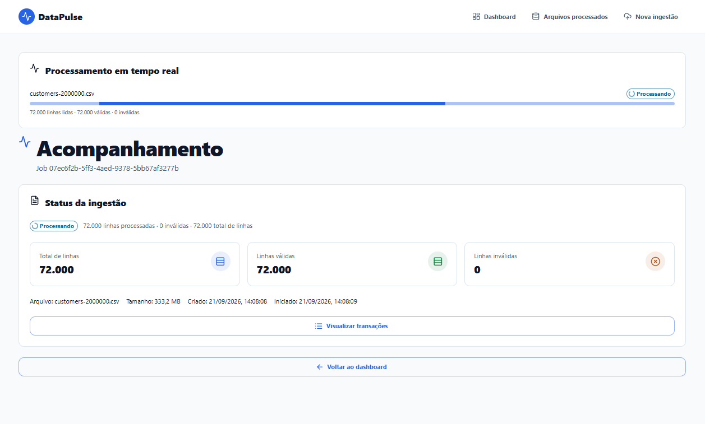
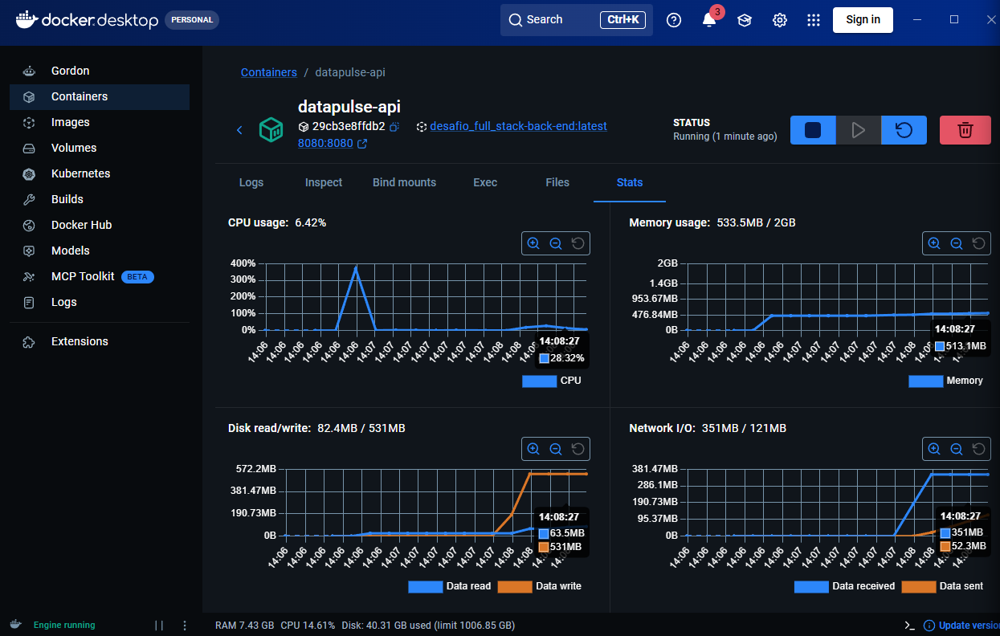
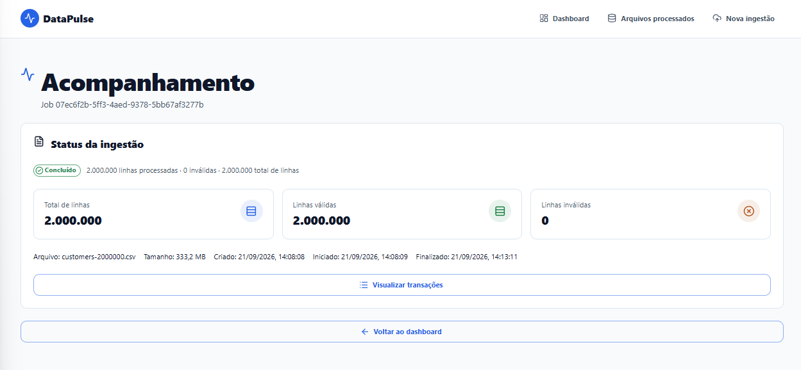
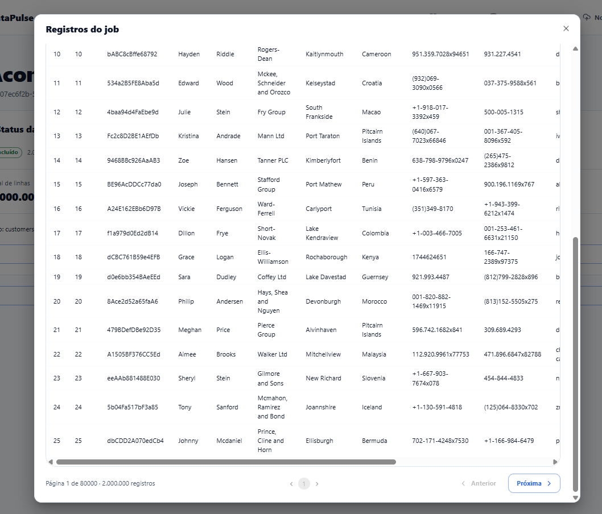

# DataPulse — ingestão em larga escala

DataPulse processa CSVs com milhões de linhas sem materializar o arquivo inteiro em RAM e sem renderizar milhões de registros no navegador.

**Lógica de processamento:** a API recebe o upload em streaming e grava o arquivo em volume temporário. RabbitMQ enfileira somente o `jobId`; em background, Spring Batch lê uma linha por vez, valida e acumula apenas um chunk limitado de 2.000 registros. Cada chunk é persistido via JDBC batch em uma transação, atualiza os contadores de progresso e libera memória antes do próximo lote. O front-end acompanha o job por polling e consulta registros paginados, nunca o CSV inteiro.

**Front-end:** React 19, Vite 8, TypeScript 6, React Router, TanStack Query, Axios, MUI, Tailwind CSS v4, Chart.js, React Hook Form, date-fns e Lucide React.

**Back-end:** Java 21 LTS, Spring Boot 4.1, Spring Batch, JPA/Hibernate, Flyway, PostgreSQL 17 e RabbitMQ 4.

React + Vite foi escolhido por oferecer desenvolvimento local rápido e leve. TypeScript mantém contratos estáticos; TanStack Query controla cache e polling; MUI entrega componentes acessíveis; Tailwind organiza layout;

Spring Batch mantém streaming/chunks; RabbitMQ desacopla ingestão; PostgreSQL fornece persistência e índices.

Java usa JPA/Hibernate como ORM. Qualidade Java usa Spotless + Google Java Format e Checkstyle opcionais pelo profile `quality`. Essas ferramentas não bloqueiam o build Docker padrão.

## Índice

- [DataPulse — ingestão em larga escala](#datapulse--ingestão-em-larga-escala)
  - [Índice](#índice)
  - [Executar](#executar)
  - [Testar arquivos CSV](#testar-arquivos-csv)
  - [Execução isolada](#execução-isolada)
  - [Arquitetura back-end](#arquitetura-back-end)
  - [Testes unitários do back-end](#testes-unitários-do-back-end)
  - [Desempenho e memória](#desempenho-e-memória)
  - [Banco, índices e mensageria](#banco-índices-e-mensageria)
  - [Dashboard e filtros](#dashboard-e-filtros)
  - [Feedback e diagnóstico](#feedback-e-diagnóstico)
    - [Consulta eficiente de registros](#consulta-eficiente-de-registros)
    - [Benchmark de ingestao](#benchmark-de-ingestao)
  - [Desenvolvimento](#desenvolvimento)
  - [Limitações conhecidas](#limitações-conhecidas)
  - [Print de testes](#print-de-testes)

## Executar

Requisito único: Docker Desktop com Compose v2.

Clone esse repositório na sua máquina. Entre no diretório do projeto e execute os comandos abaixo:

```bash
git clone https://github.com/Iago-Santos-Sousa/Desafio-Full-Stack.git
cd Desafio-Full-Stack
```

Fica a seu criterio customizar sua .env. O docker-compose.yaml já usa variáveis de ambiente default nas imagens dos serviços

Para construir ou reconstruir as imagens e os containers do zero:

```bash
copy .env.example .env
docker compose up --build
```

Para subir containers já existentes:

```bash
docker compose up
```

**Observação:**: Caso queira criar seu próprio .env, use o .env.example como exemplo

`.env` na raiz alimenta Compose. Para execução direta, backend aceita `back-end/.env` opcional e Vite aceita `front-end/.env`; copie os respectivos `.env.example`. Variáveis `VITE_*` são públicas e entram no bundle.

- Front-end: http://localhost:5173
- API: http://localhost:8080
- Swagger: http://localhost:8080/swagger-ui.html
- RabbitMQ: http://localhost:15672 (`app` / `change-me-local`)

Guias locais: [front-end/README.md](front-end/README.md) e [back-end/README.md](back-end/README.md). O contrato CSV aceita colunas dinâmicas com dialeto detectado de forma limitada: UTF-8 estrito (com ou sem BOM) e UTF-16 com BOM, usando vírgula, ponto e vírgula, tab ou pipe. O detector inspeciona somente amostra limitada; ingestão continua em streaming. Swagger documenta endpoints, schemas e exemplos em `/swagger-ui.html`.

Flyway controla schema PostgreSQL no startup da API. Em volume novo, migrations V1–V8 criam tabelas de negócio e metadados JDBC do Spring Batch; em volume existente, somente migrations pendentes executam. Hibernate usa `ddl-auto=validate` e não cria tabelas. Subir apenas o container PostgreSQL não executa migrations; veja comandos de diagnóstico e política de volumes em [back-end/README.md](back-end/README.md).

Rotas front-end:

- `/dashboard`: cards e gráfico de registros processados por período.
- `/ingestions`: jobs processados com paginação e acesso aos detalhes.
- `/ingestions/new`: upload CSV.
- `/ingestions/:jobId`: status do processamento com polling.

**Front-end**: Usa React Router, TanStack Query, MUI e Tailwind CSS v4. Tailwind organiza layout/responsividade; MUI fornece componentes e tema.

**Back-end**: Segue camadas controller, service, repository, DTO e entity, com separação pragmática entre domínio(DDD) aplicação e infraestrutura, conceitos de Clean Architecture e Clean Code.

O modal de registros no front-end, usa cursor keyset e exibe página atual, total de páginas e total de registros válidos confirmados pelo job. O total vem do contador persistido, sem `COUNT(*)` por requisição e sem `OFFSET` profundo. Após avançar, cursores ficam em cache no cliente, permitindo clicar novamente nas páginas já visitadas; páginas ainda não visitadas são alcançadas por `Próxima`.

## Testar arquivos CSV

Datasets externos opcionais, entre 100 e 2.000.000 de linhas, estão disponíveis em [Datablist — sample CSV files](https://www.datablist.com/learn/csv/download-sample-csv-files). O arquivo baixado deve respeitar encodings, delimitadores e cabeçalhos aceitos pelo detector CSV.

O serviço Docker `csv-generator` monta `./csv_tests` do host em `/data` no container.

Gerar 1 milhão de linhas sem instalar Node:

PowerShell:

```powershell
docker compose --env-file .env.example --profile tools run --rm csv-generator 1000000 /data/transactions-1m.csv
```

Git Bash exige desativar conversão automática de caminhos POSIX:

```bash
MSYS_NO_PATHCONV=1 docker compose --env-file .env.example --profile tools run --rm csv-generator 1000000 /data/transactions-1m.csv
```

Resultado no host: `csv_tests/transactions-1m.csv`. Sem terceiro argumento, `generate-csv.mjs` usa `/data/transactions.csv`.

## Execução isolada

Para executar somente API, PostgreSQL e RabbitMQ em containers:

```bash
docker compose --env-file .env.example up --build -d postgres rabbitmq back-end
```

Para executar somente front-end em desenvolvimento local:

```bash
cd front-end
copy .env.example .env
npm install
npm run dev
```

Defina `VITE_API_URL=http://localhost:8080` no `.env` do front-end. Execução conjunta continua sendo `docker compose up --build` na raiz. Docker Compose é o fluxo recomendado; Java, Maven, Node e PostgreSQL não são exigidos no host para stack completa.

## Arquitetura back-end

- Controllers tratam HTTP; services orquestram casos de uso; repositories isolam JPA/JDBC; DTOs protegem o contrato REST; entidades JPA não são retornadas diretamente.
- O núcleo de ingestão usa políticas puras (`UploadPolicy`, `IngestionOutcomeCalculator`, `JobProgress` e `JobOutcome`) para regras testáveis sem Spring, banco ou RabbitMQ.
- `CsvStorage` é uma porta de saída; `LocalCsvStorage` é o adapter de filesystem. O service não conhece diretórios nem detalhes de cópia do multipart.
- `IngestionJob` protege transições terminais e invariantes de progresso. Listener, persistência, mensageria e analytics continuam detalhes substituíveis.
- Não há reescrita artificial para “Clean Architecture completa”: módulos de leitura e analytics permanecem enxutos, sem duplicar entidades JPA e domínio quando não existe regra própria.

## Testes unitários do back-end

As regras de negócio são testadas principalmente sem iniciar Spring, PostgreSQL ou RabbitMQ. A suíte usa JUnit 5, Mockito e AssertJ, fornecidos pelo `spring-boot-starter-test`. Testes cobrem services, validators, parser/reader CSV, limite de upload, codecs de cursor, cálculo de resultado, progresso por chunk, outbox, recovery, analytics, transições da entidade e paginação de registros.

Executar todos os testes unitários dentro de container Java 21, sem instalar Maven no host:

```bash
docker run --rm -v "${PWD}/back-end:/workspace" -w /workspace \
  maven:3.9.11-eclipse-temurin-21 mvn -B test
```

Executar somente testes relacionados a CSV, progresso e paginação:

```bash
docker run --rm -v "${PWD}/back-end:/workspace" -w /workspace \
  maven:3.9.11-eclipse-temurin-21 mvn -B \
  -Dtest=CsvHeaderValidatorTest,UploadPolicyTest,DynamicCsvItemReaderTest,IngestionProgressTrackerTest,IngestionProgressWriterTest,RecordQueryServiceTest test
```

Testes de integração com PostgreSQL/RabbitMQ usam Testcontainers e ficam separados no profile `integration`; não fazem parte do ciclo unitário nem do build Docker padrão:

```bash
docker run --rm -v "${PWD}/back-end:/workspace" -v //var/run/docker.sock:/var/run/docker.sock \
  -w /workspace maven:3.9.11-eclipse-temurin-21 mvn -B -Pintegration verify
```

O profile de integração exige socket Docker acessível ao container Maven; em Docker Desktop Windows, se o socket não estiver exposto, execute somente `mvn -B test` ou use CI com Testcontainers habilitado.

Testes unitários devem ser determinísticos, rápidos e não carregar CSV inteiro em memória. Testes de endpoint, banco e broker validam integração; não substituem testes das regras de negócio.

## Desempenho e memória

- Multipart usa `file-size-threshold=0B` e grava upload em volume; limite por arquivo é 2 GiB.
- RabbitMQ publica somente `jobId`; Spring Batch lê CSV em streaming e confirma chunks de 2.000 linhas.
- `JdbcBatchItemWriter` e `reWriteBatchedInserts=true` reduzem round-trips PostgreSQL.
- `csv_record.data` usa JSONB para colunas dinâmicas; API nunca retorna milhões de registros de uma vez.
- Listagem usa cursor/keyset e paginação server-side; dashboard usa métricas agregadas.
- Container da API aceita `BACKEND_MEMORY_LIMIT`, fallback `2g`, e JVM usa limite de RAM do cgroup.

Benchmark observado no ambiente Docker: 1.000.000 linhas, 64.777.936 bytes, upload em 2.308 ms, processamento em 126.809 ms, pico API de 527,2 MiB/2 GiB e `OOMKilled=false`. Teste anterior com 2.000.000 linhas também terminou sem OOM. Resultados dependem de hardware, volume Docker, chunk e concorrência; não representam garantia universal.

## Banco, índices e mensageria

- Flyway executa migrations V1–V8 no startup da API; Hibernate usa `ddl-auto=validate`.
- Índice principal é `(ingestion_job_id, id)`, alinhado ao filtro por job e ordenação do cursor.
- Consulta de registros busca IDs pelo índice e carrega JSONB apenas da página.
- Agregações usam `ingestion_job_metric`, evitando `GROUP BY` integral em cada refresh.
- RabbitMQ usa exchange/fila duráveis, limite de cinco mensagens prontas, retry limitado, DLX e DLQ.

Valide plano com `EXPLAIN (ANALYZE, BUFFERS)` conforme [back-end/README.md](back-end/README.md).

## Dashboard e filtros

Dashboard consulta cards e gráfico por período. A rota `/ingestions` lista jobs em páginas de 10, abre detalhes por ID e consulta registros dinâmicos em modal. Filtros `from`/`to` afetam cards e gráfico; datas são inclusivas no calendário `America/Sao_Paulo`.

## Feedback e diagnóstico

- Dashboard exibe jobs ativos por polling em `/api/v1/ingestions/active`.
- Worker confirma a transição `QUEUED -> PROCESSING` em transação própria antes de iniciar `JobOperator`; `beforeJob` permanece idempotente.
- Status intermediário é gravado após cada chunk Spring Batch.
- `StepExecutionListener` inicializa tracker antes do primeiro chunk; `progress_checkpoint_failed` com `jobId=null` indica imagem antiga e exige rebuild.
- Migration Flyway V8 cria tabelas `BATCH_*`; `@EnableJdbcJobRepository` usa PostgreSQL para persistir execuções e permitir recovery por metadados.
- RabbitMQ usa outbox transacional, publisher confirms, retry limitado e DLQ para evitar jobs órfãos em `QUEUED`.
- CSV precisa ter cabeçalhos não vazios e únicos; valores dinâmicos são armazenados em JSONB. Arquivos malformados retornam `422`.
- Contrato atual aceita CSV dinâmico nos encodings/delimitadores suportados pelo detector; valores são armazenados em JSONB e exibidos pelas colunas retornadas pelo job.
- Respostas HTTP têm Problem Details e `traceId`; front-end registra resposta sanitizada e mostra toast MUI.
- Containers nomeados: `datapulse-postgres`, `datapulse-rabbitmq`, `datapulse-api`, `datapulse-web`.
- RabbitMQ limita `ingestion.jobs` a cinco mensagens prontas por política versionada; publicação rejeitada entra no retry do outbox e não descarta job.
- API comprime respostas JSON/Problem Details acima de 2KB quando cliente envia `Accept-Encoding: gzip`.
- CORS aceita somente `APP_CORS_ALLOWED_ORIGIN` (padrão `http://localhost:5173`); Swagger continua acessível em suas rotas próprias.
- API usa `SERVER_PORT` configurável, com fallback `8080`; `BACKEND_PORT` controla porta publicada no host.

- Multipart é copiado para volume, sem materializar arquivo na RAM.
- Upload limita cada CSV a 2GiB; Spring Multipart grava partes em disco e API rejeita excesso com `413 UPLOAD_TOO_LARGE`.
- Spring Batch lê linha a linha e confirma chunks de 2.000 registros.
- `reWriteBatchedInserts=true` reduz round-trips PostgreSQL.
- Paginação usa keyset por `(ingestion_job_id, id)` em `csv_record`; métricas do dashboard são mantidas em `ingestion_job_metric`.
- RabbitMQ fornece fila durável, backpressure e retry do worker.

Gerar 1 milhão de linhas sem Node local:

```bash
MSYS_NO_PATHCONV=1 docker compose --env-file .env.example --profile tools run --rm csv-generator 1000000 /data/transactions-1m.csv
```

O projeto também fornece `scripts/generate-csv.mjs` e `scripts/benchmark-ingestion.mjs`; ambos executam no serviço Docker `csv-generator` e escrevem em streaming. Arquivos de teste ficam em `csv_tests`, incluindo massas de até 2.000.000 de linhas.

### Consulta eficiente de registros

`GET /api/v1/ingestions/{jobId}/records` mantem paginacao keyset por `(ingestion_job_id, id)`. Para evitar que PostgreSQL escolha a chave primaria global ao projetar `JSONB`, o repository executa duas consultas limitadas: busca IDs da pagina (`size + 1`) pelo indice composto e depois busca `row_number`/`data` somente para esses IDs, preservando a ordem do cursor.

Nao ha `OFFSET`, `COUNT(*)` ou leitura de registros de outros jobs. Contrato REST continua retornando `columns`, `items`, `nextCursor`, `totalRecords` e `totalPages`.

### Benchmark de ingestao

Gere e processe 1 milhao de linhas em streaming:

```bash
MSYS_NO_PATHCONV=1 docker compose --env-file .env.example --profile tools run --rm \
  -e OUTPUT=/data/benchmark-1000000.csv \
  --entrypoint node csv-generator benchmark-ingestion.mjs 1000000
```

No Git Bash, prefixe o comando com `MSYS_NO_PATHCONV=1`. O caminho `/data/benchmark-1000000.csv` é persistido como `csv_tests/benchmark-1000000.csv`; caminhos em `/tmp` são descartáveis.

Em outro terminal, registre pico de memoria durante processamento:

```bash
docker stats datapulse-api datapulse-postgres datapulse-rabbitmq
```

Anote bytes, `uploadMs`, `processingMs`, linhas, chunk, concorrencia e pico de memoria. Execucao sem OOM nao substitui benchmark controlado em hardware e limites documentados.

`BACKEND_MEMORY_LIMIT` limita memoria do container da API; fallback local e `2g`. Ajuste essa variavel no `.env` antes de comparar cenarios.

## Desenvolvimento

Dependências e toolchains locais são opcionais. Dockerfiles usam build multi-stage. Versões ficam fixadas em `pom.xml`, `package-lock.json`, Dockerfiles e Compose. Consulte documentação oficial/Context7 antes de alterar APIs ou versões.

## Limitações conhecidas

Volume local atende execução single-host. Escala distribuída em um ambiente real de produção exigiria object storage compartilhado e workers separados. Chunk size, heap e índices devem ser ajustados por benchmark com `EXPLAIN (ANALYZE, BUFFERS)` e carga representativa. A consulta em duas etapas reduz filtro por milhões de linhas, mas cada ambiente deve confirmar plano e tempos com dados representativos.

## Print de testes









